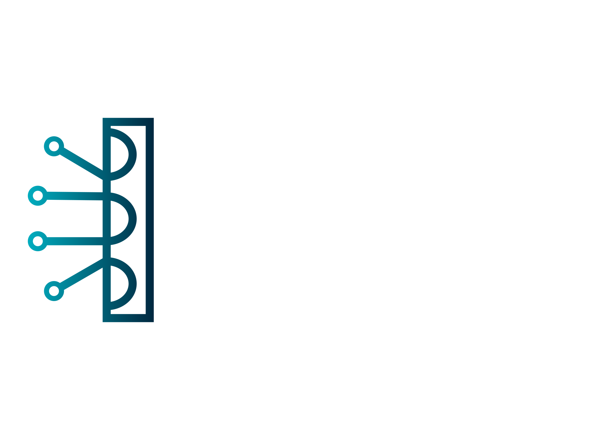

<p align="center">
  
</p>

## Overview

Watch the following videos to get an in-depth understanding of AITMS's capabilities:

### Real-time Car Detection with YOLO v8

<video width="640" height="360" controls>
  <source src="bandicam 2024-01-07 02-56-44-211.mp4.mp4" type="video/mp4">
  Your browser does not support the video tag.
</video>


AITMS is an innovative Traffic Management System incorporating YOLO v8 for real-time car detection and the Max Pressure Traffic Algorithm for intelligent signal timing adjustments. This system provides accurate traffic monitoring, behavior analysis, and dynamic congestion reduction at intersections.

## 🚀 Key Features

- **Real-time Detection:** Utilize YOLO v8 for precise and fast car detection.
- **BOT-Tracking Algorithm:** Analyze vehicle behavior and detect violations with advanced tracking.
- **Max Pressure Traffic:** Dynamically optimize traffic signal timings based on vehicle density for reduced congestion.

## 🛠️ Installation

1. **Clone the repository:**

    ```bash
    git clone https://github.com/your_username/traffic-eye.git
    cd traffic-eye
    ```

2. **Install Dependencies:**

    ```bash
    pip install -r requirements.txt
    ```

## 🌐 Usage

1. **Run the AITMS System:**

    ```bash
    python main_system.py
    ```

2. **Access the Monitoring Dashboard:**

    Open your browser and go to [http://localhost:5000](http://localhost:5000).


## 📜 License

This project is licensed under the [MIT License](LICENSE).

## 🙌 Acknowledgments

Thanks to our cross-functional team for their collaboration and dedication to developing AITMS.


